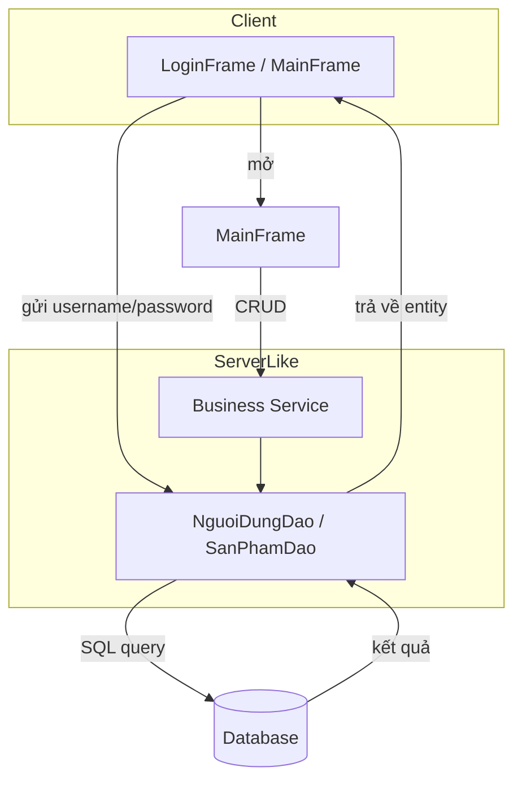

# Cửa Hàng Thuốc — Hệ thống quản lý bán hàng

Một ứng dụng desktop Java Swing để quản lý bán hàng cho nhà thuốc nhỏ: đăng nhập, quản lý sản phẩm và lô hàng (FEFO), tạo hoá đơn bán hàng và báo cáo cơ bản.

---

## Project Title

Cửa Hàng Thuốc — Ứng dụng quản lý bán hàng cho nhà thuốc

Mô tả ngắn: "Nhanh — Nhẹ — Dễ dùng". Giao diện desktop (Java Swing) với tầng dữ liệu DAO để thao tác trực tiếp với cơ sở dữ liệu.

---

## Tech Stack

| Thành phần | Công nghệ / Ghi chú |
|---|---|
| Frontend (UI) | Java Swing, FlatLaf (theme) |
| Business / Backend | Java (DAO pattern), Service layer (tùy dự án) |
| Database | MySQL / MariaDB / SQL Server / SQLite (tùy cấu hình) |
| Build & Dependency | Maven (pom.xml) |
| Testing | JUnit (khuyến nghị) |
| Tools & Utilities | Maven, Git, (tùy chọn Docker) |

> Ghi chú: Workspace hiện chứa nhiều module/bài tập; README này tập trung mô tả module `CuaHangThuoc`.

---

## Architecture & Logic

Mục tiêu kiến trúc: Ứng dụng Swing hoạt động như client nhẹ, gọi trực tiếp vào tầng DAO (JDBC) hoặc gọi service nội bộ để thực hiện CRUD với database.

Luồng đăng nhập và điều hướng chính (ví dụ):



Luồng dữ liệu chính (tóm tắt):
- UI (Java Swing): Xác thực đầu vào, hiển thị dữ liệu, điều hướng màn hình.
- DAO: Thực hiện truy vấn SQL (JDBC) và ánh xạ kết quả vào entity.
- Service (khuyến nghị): Nhận dữ liệu từ UI, áp dụng business logic (FEFO, kiểm tra hạn), gọi DAO để lưu/đọc.
- Database: Lưu bảng người dùng, sản phẩm, lô hàng, hoá đơn, nhà cung cấp, khách hàng.

Cấu trúc thư mục đề xuất (module `CuaHangThuoc`):

```
CuaHangThuoc/
├─ pom.xml
├─ src/
│  ├─ main/
│  │  ├─ java/
│  │  │  ├─ app/         # LoginFrame, MainFrame, các Panel
│  │  │  ├─ dao/         # NguoiDungDao, SanPhamDao, ...
│  │  │  ├─ entity/      # NguoiDung, SanPham, LoHang, HoaDon, ...
│  │  │  └─ common/      # ConnectDB, ColorScheme, IconHelper
│  │  └─ resources/
│  └─ test/
└─ database/             # (tùy) script SQL tạo schema mẫu
```

---

## Key Features

Hoàn thiện / Có sẵn:
- Đăng nhập người dùng (LoginFrame) với kiểm tra qua `NguoiDungDao`.
- Giao diện chính (MainFrame) và cấu hình theme FlatLaf.
- Các entity cơ bản và DAO mẫu (NguoiDung, SanPham - tuỳ module).

Đang phát triển / Gợi ý mở rộng:
- Quản lý sản phẩm (CRUD, ảnh, phân loại).
- Quản lý lô hàng theo FEFO (tự động chọn lô xuất hàng, kiểm tra hạn sử dụng).
- Hệ thống hoá đơn bán hàng (tạo hoá đơn, in/ xuất file PDF/Excel).
- Báo cáo doanh thu, thống kê tồn kho và cảnh báo hàng sắp hết hạn.
- Phân quyền chi tiết (Admin / Quản lý / Nhân viên).
- Tách Service layer / Viết Unit Tests cho DAO (sử dụng H2/SQLite in-memory).

---

## API Endpoints (ví dụ minh hoạ)

Lưu ý: Dự án hiện là ứng dụng desktop kết nối trực tiếp qua JDBC; bảng dưới đây chỉ là mẫu nếu bạn quyết định triển khai REST API.

| Phương thức | Endpoint | Mô tả |
|---:|---|---|
| POST | /api/auth/login | Xác thực người dùng (trả token/session) |
| GET | /api/products | Lấy danh sách sản phẩm (paging/filter) |
| POST | /api/products | Tạo sản phẩm mới |
| PUT | /api/products/{id} | Cập nhật sản phẩm |
| POST | /api/sales | Tạo hoá đơn bán hàng |

---

## Installation & Setup (Local)

Các hướng dẫn dưới đây giả định bạn đang dùng Windows (cmd.exe), Maven và JDK đã cài.

Bước nhanh (IDE):
- Mở project `CuaHangThuoc` trong IDE (IntelliJ / Eclipse).
- Chạy class `app.LoginFrame` hoặc cấu hình run configuration để chạy ứng dụng Swing.

Chạy qua Maven (terminal Windows):

```cmd
cd "c:\Users\havin\OneDrive\Desktop\assets\CuaHangThuoc"
mvn clean package
rem Nếu artifact là jar với main class, chạy:
java -jar target\<tên-artifact>.jar
```

Chuẩn bị Database (ví dụ MySQL):
1. Tạo database và user.
2. Chạy file SQL schema nếu có trong `database/`.
3. Cập nhật cấu hình kết nối (xem phần Environment Variables bên dưới).

Docker (tùy chọn):
- Nếu bạn muốn chạy DB nhanh, tạo `docker-compose.yml` gồm service DB (MySQL) và (nếu cần) một container để chạy app.

---

## Environment Variables

KHÔNG lưu secrets thực tế trên repo. Dưới đây là ví dụ các biến cần cấu hình (hoặc có thể lưu trong `config.properties`):

| Biến | Ví dụ | Mô tả |
|---|---|---|
| DB_URL | jdbc:mysql://localhost:3306/cuahangthuoc | JDBC URL kết nối database |
| DB_USER | cuahang_user | Tên user database |
| DB_PASSWORD | (không commit) | Mật khẩu database — lưu ngoài repo |
| DB_DRIVER | com.mysql.cj.jdbc.Driver | Driver JDBC nếu cần |
| APP_PROFILE | dev | Môi trường: dev / prod |

Cách truyền biến:
- Windows cmd: set DB_URL=jdbc:... && mvn exec:java
- Docker: dùng `environment:` trong docker-compose hoặc `-e` khi chạy docker run

---

## Security & Best Practices

- Không commit mật khẩu, API keys hay file cấu hình chứa secrets.
- Dùng connection pooling (HikariCP) và prepared statements để tránh SQL injection.
- Thêm logging (SLF4J + Logback) và migration scripts (Flyway/Liquibase) cho môi trường sản xuất.

---

## Quick Checklist cho người mới vào repo

- [ ] Cài JDK 11+ hoặc 17+
- [ ] Cài Maven
- [ ] Tạo database và chạy script nếu có
- [ ] Thiết lập biến môi trường DB_* hoặc `config.properties`
- [ ] Chạy `mvn clean package` và chạy app hoặc mở trong IDE và chạy `app.LoginFrame`

---

## Next Steps (gợi ý phát triển)

1. Thêm Service layer để tách business logic khỏi DAO.
2. Viết unit tests cho DAO và service (sử dụng H2 in-memory).
3. Cân nhắc tách backend REST (Spring Boot) nếu cần multi-client.
4. Thêm Dockerfile / docker-compose để dễ triển khai.

---

Nếu bạn muốn, tôi có thể bổ sung README tiếng Anh, tạo file `docker-compose.yml` mẫu hoặc viết script SQL schema mẫu. Vui lòng cho biết bước tiếp theo bạn muốn tôi thực hiện.